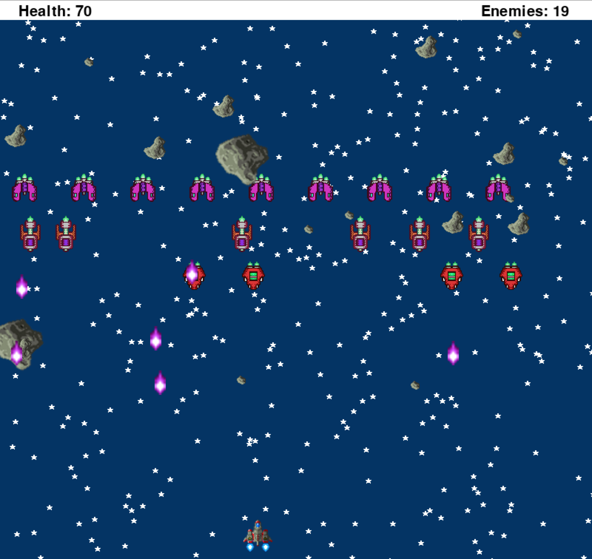

Space Defender

Before running the game you must have python and pygame installed on machine. 
To run navigate to src folder and type "pythonw Destroy.py"

Goal of the game is to get to the end.  
Controls:
	<ul>
	   <li>a: move ship left</li>
	   <li>d: move ship left</li>
	   <li>space bar = shoot</li>
	   <li>p: pause</li>	
	   <li>"cheat button" +: increase health</li>
	</ul>

Ship starts with 100 health points. 
Once 4th and 5th round has begun you get 100 health again. 
5 levels to the game object is to destroy everything.  
9 new enemy ships added per level:
	<ul>
	   <li>ships shoot downward at random</li>
	   <li>you can shoot enemy shots aswell</li>
	   <li>if shot by an enemy ship you lose 20 HP</li>
	</ul>
Ships drop down a level at random. 
At the begining of each level the ships spawn closer to you.  
Asteroids spawn at random with different speeds and directions:
	<ul>
	   <li>3 different types of asteroids.</li>
	   <li>Largest takes away 30 hp.</li>
	   <li>Medium takes away 10 hp.</li>
	   <li>Smallest takes away 5 hp.</li>
	</ul>
When largest asteroid is shot it splits into two medium sized ones. 
When medium asteroid is shot it is split into two small asteroids.

Created by: Edgar Galindo

Credits:
Background music by ericskiff.com "all of us"
Sprites by arboris "found on google and on mulitple sites"
Explosion sounds mediacollege.com soundbible.com awdpro.com

